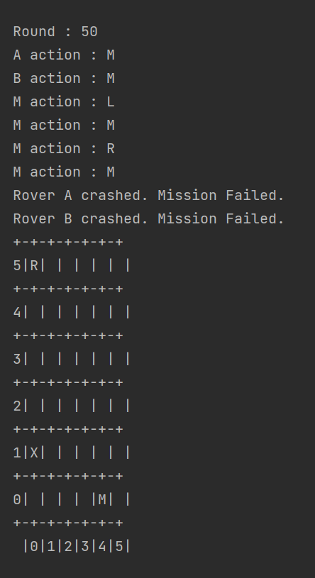

# MarsRover

The main() is in Mars.java.  Run the main() to start the program.

The constructor of Mars take one string argument in form of "x y".  Then program will create a grid accordingly.
It is hardcoded to create two rovers, one martian and one rock on Mars.  Their positions are randomly set.
Information and the grid will be displayed in console.

**Example:** 

 
  
 
 "A" - rover A 
 "B" - rover B 
 "M" - martian 
 "R" - rock 
 0-5 are row numbers and column numbers 
 
 Every round all movable object will move or spin once.  Rock does not extend movable so it cannot move. 
 Rover may spin ("L", "R") or move ("m").  Martian does not spin but it moves diagonally and randomly.  
 
  
  
  
 
 
 After each round, if two or more objects land on same box, Mars broadcast "CLASH" event.   
 Objects involved in this event have to respond. 
 
 
 **\[ Rover clash with Martian \]** 
 Rover print message "Martian, watch out !!!!!" 
 Martian will dodge (randomlly and diagonally move to new position). 
  
  Example 

  
  
  
  
 
  **\[ Martian clash with rock \]**  
  Martian prints message "Martian kick away a rock.". 
  The rock will randomly move to new location. 
   
  Example 

  
  
  
  
  
   **Rover clash with rover**  
  Rover prints message "Rover A crashed. Mission Failed.".  Then **Game is over**.   
  The box where the rovers crashed will be marked as "X". 
   
  Example 

   
   
   
  
  **\[ Rover clash with rock \]**  
  Rock does nothing. 
  Rover prints message "Rover has found a rock.  Mission accomplish".  **Game is over**. 
  The box where the rover found a rock will be marked with "@". 
  
  Example  
  

  
 
 

Please note if grid size is big, it may takes hundreds or thousands rounds to end the game.   
  
  
  
 
 
 
 
